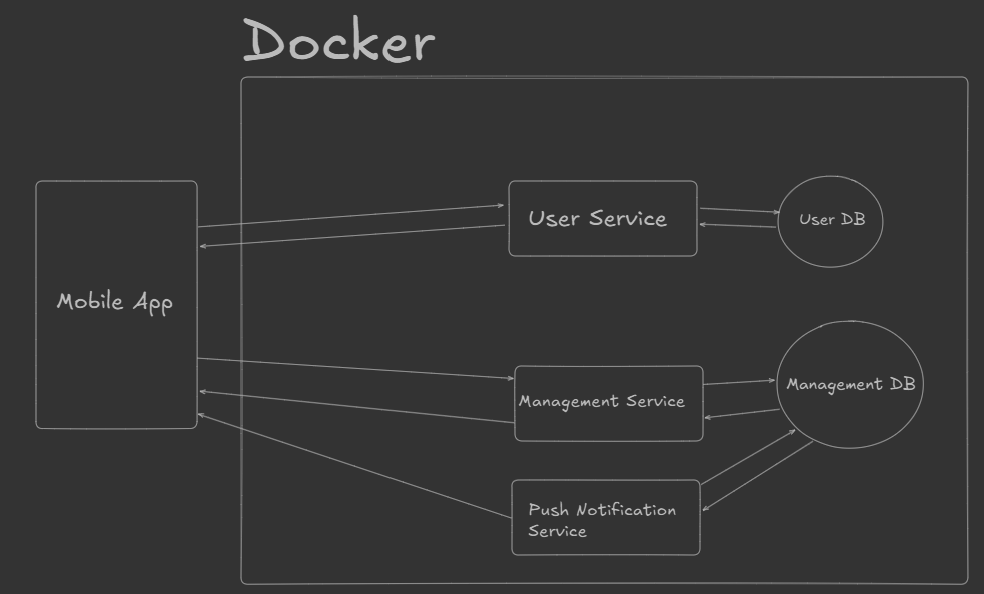
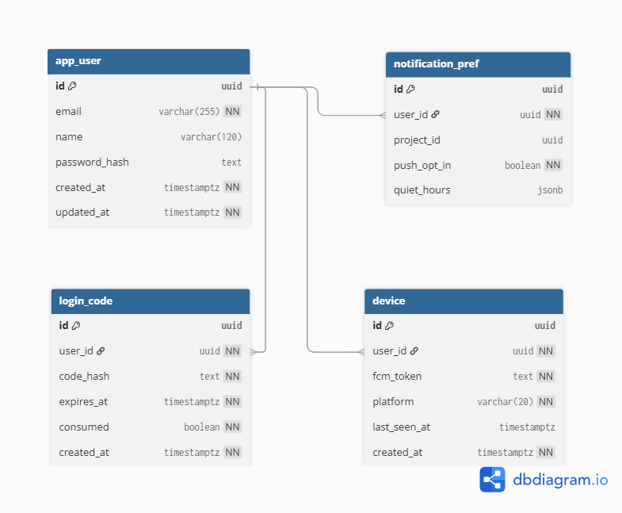
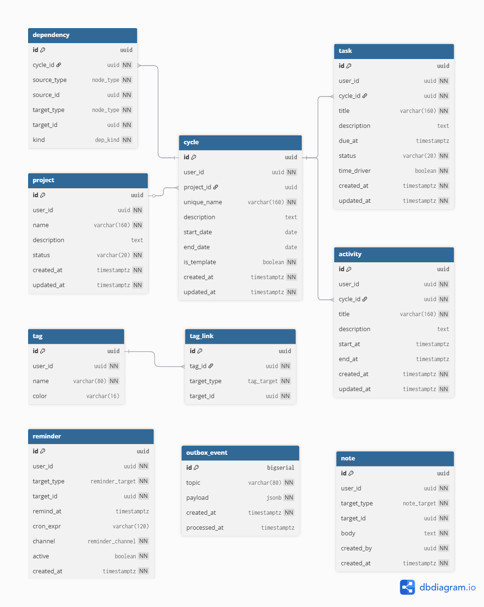

# ICT302-FYP-TaskManagement

#### Date : 04 Sep 2025

--- 

## Requirements: 

-  <b> Display General Information of the cycle </b> - unique name etc. 
- <b> Display Activities </b> - A non-actionable event that takes place during the cycle, and it will span over the duration of the project. e.g. grow the seedlings 
- <b> Display Tasks </b> - An actionable event that will request confirmation or update of information on the task status. In a variable calendar this type event may change the time line if it has other activities or tasks dependent on it 
- <b> Display Tags </b> - This is used as an organisational tool. It can be created by user for the purpose of tag a group of tasks or activities ( Tags are a bit difficult to describe but they allow a user to group or identify tasks or activities into a higher logical grouping) 
- <b> Display Reminders </b> - This will provide an option for user whether they want to send a push notification or add a reminder list to certain activities and tasks. 
- <b> Display Notes </b> - This served as a general information which can be added to all other components This system will need to do the following. 
- <b> Create Project </b> - It will allow the user to create new project by selecting an existing cycle as a template or create a new cycle. 
- <b> Create a repeating process template </b> - allow user to create multiple instances of cycles, and it may have the following components: Activities, Tasks, Tags, Reminders, Notes. 
- <b> Adding Components </b> - allow user to add different components such as Activities, Tasks, Tags, Reminders or Notes to every cycle 
- <b> Push Notification Service </b> - User will be automatically opting in for notification services, and it will allow user to receive information that are triggered by reminder events.

---- 

## High-level Architecture

### Android App (Kotlin)
- MVVM + Jetpack Compose (or XML)
- Room (optional) for offline cache
- WorkManager for sync
- Firebase Cloud Messaging (FCM) for push notifications
- Retrofit + OkHttp for REST API communication
- OAuth2/OIDC (Keycloak) for authentication (JWT for API calls)

### Backend (Spring Boot 3.4)
- Spring Web, Spring Data JPA, Spring Validation
- Spring Security (Resource Server) with Keycloak (JWT)
- Scheduler: Spring `@Scheduled` or Quartz for reminder triggers
- Optional: Redis for queues/deduplication of reminder jobs

### Database (PostgreSQL)
- Strong relational model for cycles, templates, and dependencies

### Notifications
- Backend triggers reminder events and pushes to FCM tokens registered by the app
- User can opt out per project or globally

## Design (Draft)

## User Database Schema (Draft)

## Task Management Database Schema (Draft)

